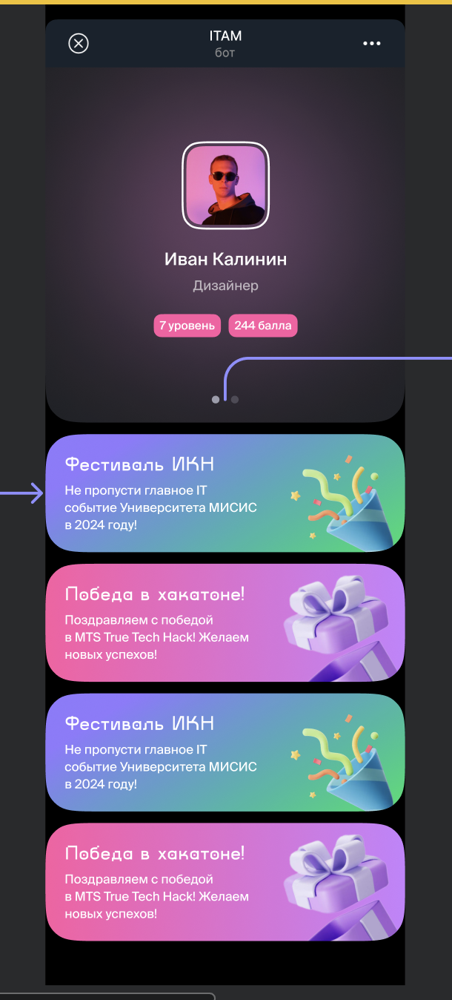

## Общая концепция

Mini app - веб страница, открывающаяся из телеграм бота, расширяющая его функционал посредством дополнительных возможностей web ui

В нашем случае, mini app нужен для отображения подробной информации о профиле и взаимодействии с некоторыми функциями, который переедут из бота в mini app

## MVP

На данном этапе ожидаемый функционал от mini app:

- Отображение личного профиля, его редактирование
- Отображение списка мероприятий и возможность:
    - на них зарегистрироваться (обсуждается, нужно ли это)
    - показать qr для прохода на мероприятие

## Подробное описание

### Экран загрузки

Нужно сделать что-то похожее на загрузку на лендинге итама

### Главный экран

Ожидается разделить экран на две зоны:

- статическая верхняя часть: Зона профиля пользователя:
    
    - Имя
    - Фамилия
    - Академическая группа
    - Фото
    
    Все этим поля должны редактироваться на месте (я бы не хотел переходить в отдельный экран для измененя профиля, для mvp будет проще если сделаем как можно меньше экранов)
    
- Динамическая нижняя часть со списком мероприятий. Референс на текущий дизайн
    

Вот похожий список карточек должен быть про мероприятия, в карточке должно быть:

- название
- краткое описание
- возможно какая-то маленькая фотка

При нажатии на мероприятие открывается либо pop-up либо другая страница с:

- информацией о мероприятии (также краткое описание + ссылка на подробную инфу, то есть на пост и тд и тп)
- Большой qr в центре, который пользователь будте показывать при проходе на мероприятие