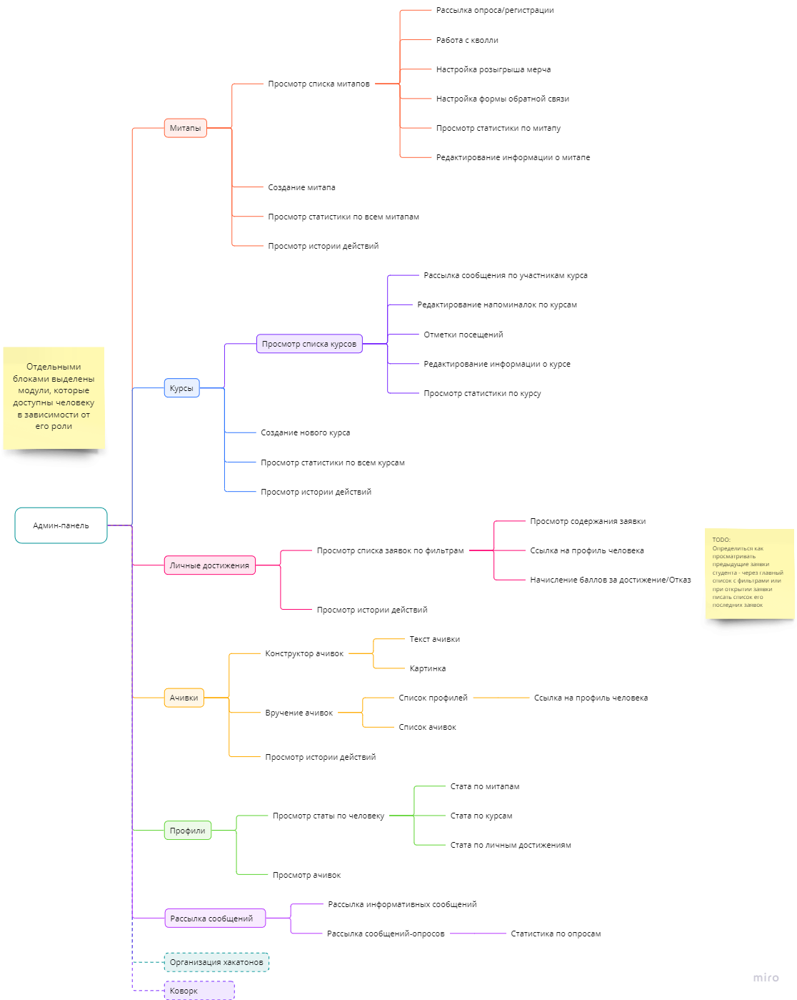
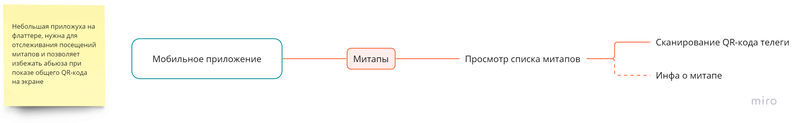
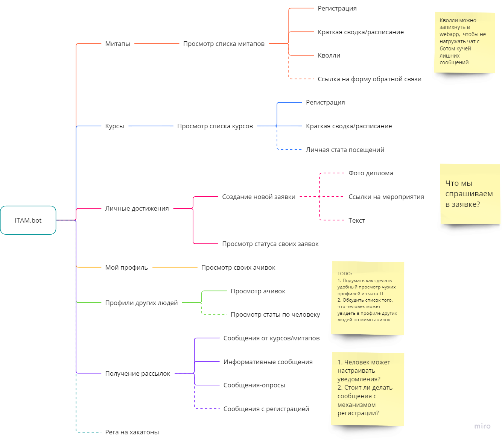

# Схема юзерфлоу

TODO: добавить ссылку на миро

## Схема админ-панели

## Cхема мобильной приложухи

## Cхема бота

# Основные модули

## Система контроля доступа

<aside> 💡 Основной модуль для создания, настройки и выдачи прав остальным пользователям, доступен только супер-админу

</aside>

Все остальные модули, которые представлены ниже - имеют свой “тэг”. Для получения доступа к модулю, пользователю назначаются соответствующие теги

### **Функционал**:

1. Просмотр списка пользователей
    1. Редактирование пользователя
    2. Настройка прав доступа (тэги)
2. Просмотр истории действий
    1. Логирование пользователя, действия и времени

## Митапы

<aside> 💡 Создание, настройка, проведение митапов

</aside>

### **Функционал админа**:

1. Создание митапа
    1. Название
    2. Баннер
    3. Расписание
    4. Доп. информация
    5. Тэги (для разделения на типы, категории и т.д.)
    6. Настройка кол-во баллов за посещение
2. Просмотр списка митапов
3. Взаимодействие с конкретным митапом
    1. Просмотр информации о нем
    2. Редактирование инфы
    3. Запуск рассылок/опросов по митапу
        1. Текст
        2. Картинка (опционально)
        3. Содержание опроса (опциально)
        4. Отправить сейчас или поставить отправку в определенное время
    4. Интеграция с кволли
    5. Настройка и запуск розыгрышей
    6. Настройка обратной связи
        1. Заводим шаблоны форм
    7. Просмотр статистики (воронка)
        1. Сколько людей зарегистрировалось
        2. Сколько людей пришло
        3. Сколько людей участвовало в каждом из кволли
        4. Сколько людей отправило обратную связь
4. Просмотр статистики по всем митапам
    1. Агрегируем стату каждого из митапов по фильтрам
        1. Фильтрация по тегам
        2. Фильтрация по датам
        3. Точечная фильтрация (выбор конкертных митапов чекбоксом)?
    2. Рисуем круговую диаграмму для определения доли популярности каждого из митапов
    3. Рисуем график для каждой из метрик воронки (кол-во рег, кол-во фактически пришедших и т.д.), где по оси X - даты, а по оси Y - кол-во участников
5. Просмотр истории действий
    1. Просто логируем пользователя, время и действие

### **Функционал мобильного приложения оргов:**

1. Получить список митапов
2. Взаимодействие с конкретным митапом
    1. Просмотр инфы о митапе
    2. Скан QR-кода - каждый участник подходит к организатору и дает отсканировать его QR-код тг-акка, чтобы в системе отметилось посещение митапа

### **Функционал пользователя бота:**

1. Просмотр списка митапов
2. Регистрация на митап
3. Участие в кволли (webapp)
4. Кнопка с ссылкой на форму обратной связи

## Курсы

<aside> 💡 Ведение курсов, сбор статы

</aside>

Так же для каждого из курсов стоит добавить отдельный подтэг доступа, чтобы выдавать ведущим курсов функционал для проведения

### **Функционал админа**:

1. Создание курса
    1. Инфа
    2. Баннер
    3. Даты
    4. Расписание
    5. Настройка кол-во баллов за посещение/прохождение
2. Просмотр списка курсов
3. Взаимодействие с конкретным курсом - совпадает с функционалом ведущего курсов
4. Просмотр статистики всем курсам
    1. Сколько людей зарегалось
    2. Сколько людей пришло
    3. Сколько людей закончило
5. Просмотр истории действий
    1. Логирование пользователя, действия и времени

### **Функционал ведущего курсов:**

1. Редактирование инфы о курсе
    1. Инфа
    2. Баннер
    3. Даты
    4. Расписание
2. Рассылка сообщений участникам курса
3. Редактирование напоминалок о курсе
    1. Текст
    2. Дата и время, настройки регулярности
4. Просмотр посещений и отметки
    1. Список участников, которому проставляются галочки
5. Просмотр статистики по курсу
    1. Сколько людей зарегалось
    2. Сколько людей пришло в такой-то день
    3. Сколько людей закончило

### **Функционал пользователя бота:**

1. Просмотр списка курсов
2. Взаимодействие с конкретным курсом
    1. Регистрация
    2. Просмотр инфы и расписания
    3. Возможно показ личной статы посещений?

## Личные достижения

<aside> 💡 Сбор дипломов, начисление баллов магазина

</aside>

### **Функционал админа**:

1. Просмотр списка заявок по фильтрам
    1. Фильтр по человеку
    2. Фильтр по датам
2. Взаимодействие с конкретной заявкой
    1. Просмотр содержание заявки
    2. Ссылка на профиль пользователя
    3. Обработка заявки
        1. Либо начисление баллов - при начислении **уровень (progress bar)** пользователя растет
        2. Либо отказ с указанием причины
3. Просмотр статистики по всем заявкам с фильтрами
    1. Фильтр по человеку
    2. Фильтр по датам
4. Просмотр истории действий
    1. Логирование пользователя, действия и времени

### **Функционал пользователя бота:**

1. Создание новой заявки
2. Просмотр статусов отправленных заявок
    1. В ожидании
    2. Начислено N баллов
    3. Отказ: _причина отказа_

## Ачивки

<aside> 💡 Конструктор ачивок и их вручение

</aside>

### **Функционал админа**:

1. Конструктор ачивок
    1. Картинка
    2. Короткий текст
    3. Настройка сколько баллов начислить (опционально)
    4. Возможно какой-то доп тэг (например для разделения по клубам)
2. Вручение ачивок
    1. Выбираем пользователей из списка
    2. Выбираем ачивку
    3. К ачивке так же приписывается время вручения
3. Просмотр истории действий
    1. Логирование пользователя, действия и времени

## Профили

<aside> 💡 Просмотр людей и их достижений

</aside>

У каждого участника есть свой профиль, который содержит список его достижений, чтобы другие люди могли +- понять что это за человек

Так же у каждого будет **progress bar** - при загрузке достижений опыт человека растет, уровень увеличивается, в дальнейшем эти баллы будут использоваться для магазина мерча

### **Функционал админа**:

1. Просмотр списка всех профилей
    
2. Взаимодействие с конкретным профилем
    
    1. Просмотр статистики по человеку
        1. Стата по митапам
        2. Стата по курсам
        3. Стата по личным достижениям
    2. Просмотр информации
        1. ФИО
        2. Группа
        3. Ссылка на тг
        4. И т.д.
    3. Просмотр уровня пользователя
    4. Просмотр ачивок пользователя
    
    ### **Функционал пользователя бота:**
    
    1. Открытие конкретного человека
        1. Просмотр ачивок
        2. Просмотр среза инфы
        3. Просмотр уровня пользователя

## Рассылка сообщений

<aside> 💡 Общий модуль рассылок, не связанных с другими конкретными модулями Можно проводить опросы и смотреть по ним стату

</aside>

### **Функционал**:

1. Настройка информативного сообщения
    1. Текст
    2. Баннер
    3. Отправить сейчас или выбрать время
2. Настройка сообщения-опроса
    1. Текст
    2. Баннер
    3. Варианты вопросов
    4. Отправить сейчас или выбрать время
3. Просмотр статистики по сообщениям-опросам
    1. Аналогично как в телеге - кол-во людей и % проголосовавших за каждый из вариантов, можно докинуть ссылки на проголосовавших людей
4. Просмотр истории рассылок и действий
    1. Логирование пользователя, действия и времени

## _Организация хакатонов_

<aside> 💡 Можно подумать как интегрироваться с ноушеном и автоматизировать процесс сбора команд и их сопровождения

</aside>

## _Коворк_

<aside> 💡 Вот тут можно подумать как считать кол-во людей в коворке в реальном времени

</aside>

## _Метрики_

<aside> 💡 Подумать на счет того, чтобы можно было легко обмазывать различные действия пользователей метриками низкого уровня - сколько раз нажали кнопку “статус коворкинга”, это поможет посчитать популярность наших внутренних сервисов

</aside>

# Какие ресурсы задействуем

Список того что входит во всю систему:

1. ITAM.bot
2. Кволли
3. Админ-панель
4. Мобильно приложение для оргов - делаем на флаттере, чекаем посещения
5. Ноушен?

Необходимо накидать какой-то минимальный дизайн, с бОльшим упором на UX, чтобы запустить в разработку админ-панель.

Так же интегрируем кволли, которые будут настраиваться из этой самой админки. Для пользователей бота кволли можно запихнуть в webapp окошко, таким образом, дополнительной логики в боте будет совсем немного для этого модуля

Мобильное приложение - самый дешевый и простой в реализации вариант для трекинга мероприятия, под капотом использует всего 2-3 ручки, дизайн не сильно важен, т.к. выполняет только 1 функцию

Возможно еще какие то интеграции с ноушеном можно накидать, если будет иметь смысл

# Какие ресурсы у нас сейчас есть

Олег - достанет бизнес-логику из бота в отдельный бэкенд сервис

Бэкенд - “фронт” для админки делаем на Streamlit

Фронтенд - Вебаппы на реакте/свелте

Флаттер - приложуха для скана QR-кодов на флаттер

**Потенциальные разработчики**:

- Тимофей - Бэкенд +
- Соня - Бэкенд +
- Гена - Флаттер
- Ярик - Фронтенд +
- Марго - Дизайн (для профилей)

# Роадмапа

**Приоритеты:**

1. Первый этап
    1. Переход на связку бот + бэкенд-сервис (экспорт системы доступа из бота + добавление лайоутов из бэка)
2. Второй этап
    1. Митапы
    2. Личные достижение
    3. Профили
    4. Приложение для скана митапов
3. Третий этап
    1. Ачивки
    2. Курсы

[ТЗ на разработку](ТЗ%20на%20разработку.md)